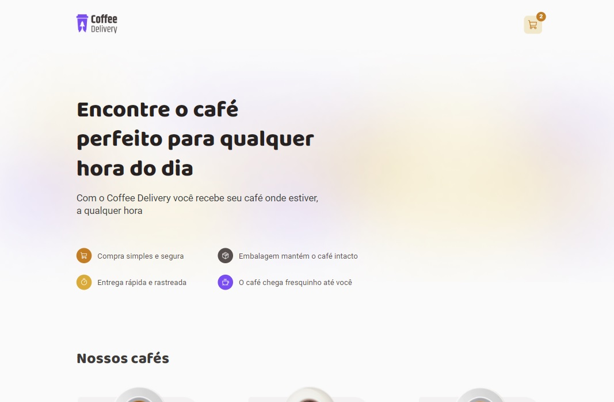

# Coffee Delivery

A simple project made with React + TypeScript which simulates an online coffee shop.

- React.js
- TypeScript
- [Styled Components](https://styled-components.com/)
- [React Hook Form](https://react-hook-form.com/)
- [Zod](https://zod.dev/)

You can test it [here](https://coffee-delivery-react.web.app/)

[Design](https://www.figma.com/file/8XTipriDmj3W2cOLetHzNq/Coffee-Delivery?t=r9fHhKByOHFOAbso-6) not made by me, I only coded the app

##Installation

Clone the repository:

`
git clone https://github.com/9uifranco/coffee-delivery.git
`

Install dependencies:

`
npm install
`

Run dev script:

`
npm run dev
`
